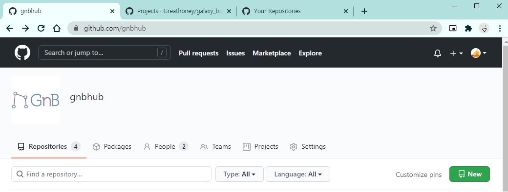
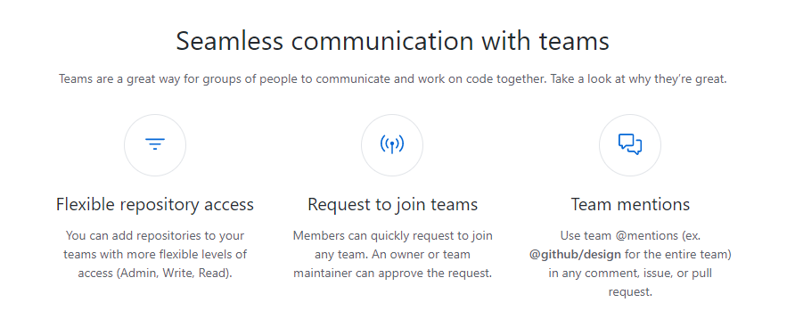
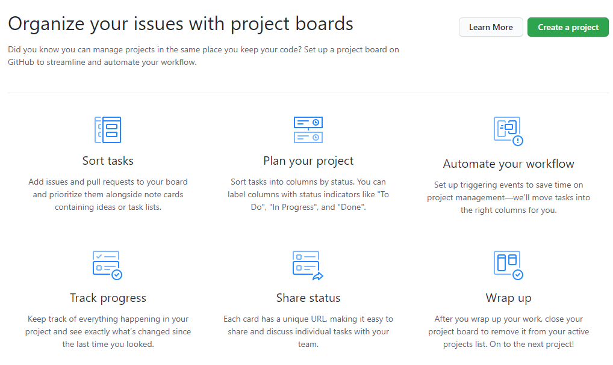

# GNB 동아리 소프트웨어 저장소 gnbhub

스터디나 프로젝트 등 GNB 동아리에서 활동한 것들을 정리하거나, 개인이 공부한 것을 여기에 올릴 수 있습니다.

또한 gnbhub을 통해 동아리원과 효율적인 소통 및 팀워크를 할 수 있습니다.

## github organization 사용법
(기본적인 github 사용법은 여기서 다루지 않습니다.)

https://github.com/gnbhub 에 들어오게 되면 위 그림과 같이 여러 개의 메뉴를 볼 수 있습니다.

### Repositories

github organization에서 제공하는 Repositories는 개인 Repositories의 사용법과 동일합니다.

Repositories에는 나와 다른 사람이 만든 레포지터리가 들어있습니다. 내가 만든 레포지터리만 관리자 권한(Owner)을 가지고 있어 Read/Write/Manage를 할 수 있지만, 다른 사람의 레포지터리는 Manager를 제외하고 Read만 가능합니다.

우측 하단의 녹색 New를 누르면 새 레포지터리를 만들 수 있으며 해당 페이지의 import 링크를 통해 이미 만들어진 레포지터리도 그대로 가져올 수 있습니다.

레포지터리의 제목은 자유롭게 작성해도 되나, 설명란은 다른 레포지터리의 양식과 같이 구체적으로 작성해 주시기 바랍니다.

### Teams

github organization에서 제공하는 Teams는 말 그대로 팀을 구성할 때 유용하게 사용할 수 있습니다. 팀원과 팀이 사용할 레포지터리가 있으면 되며, 해당 팀 레포지터리의 권한을 일괄적으로 조정할 수 있습니다.

팀 멘션으로 github에서 팀원을 부를 때 사용할 수 있고, Teams안에 또 다른 Teams를 만들거나 Projects를 만들어서 관리할 수 있습니다.

### Projects

github organization에서 제공하는 Projects는 개인 Projects의 사용법과 동일합니다. Projects는 말 그대로 현재 진행하고 있는 프로젝트를 관리하는데 유용하게 사용할 수 있습니다.

Projects는 현재 진행되고 있는 Task나 TODO등 작업의 흐름을 효율적으로 관리할 수 있습니다. 또한 여러 개의 레포지터리를 연결할 수 있습니다.

프로젝트가 종료되면 close를 통해 프로젝트를 닫을 수 있습니다.